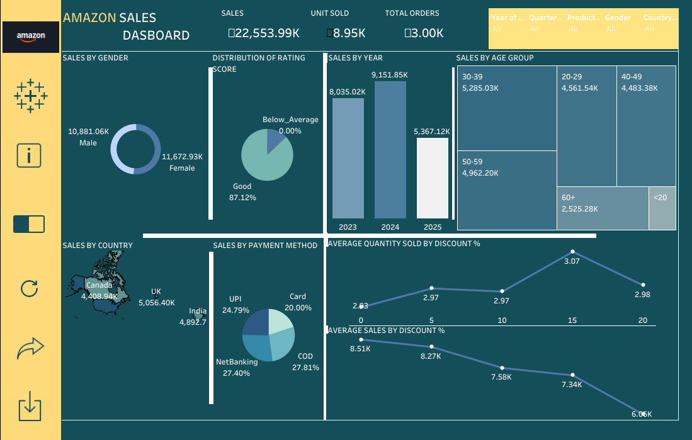
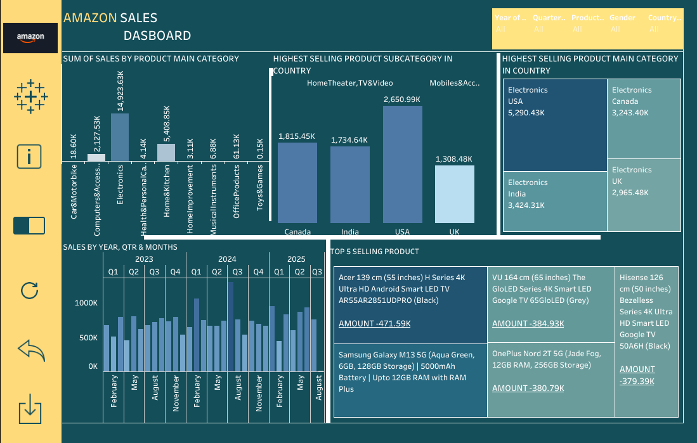

# AMAZON-SALES-ANALYSIS-TABLEAU-DASHBOARD-
TABLEAU DASHBOARD
Project Overview
This project analyzes an Amazon sales dataset containing product details, customer details, location details, sales details  
The main objectives are:  

- Explore sales distribution across categories, subcategories, and payment methods 
-  Generate meaningful insights on customer preferences, pricing patterns, and sales performance.
- Provide visualizations to communicate trends effectively.
- 
## 📂 Dashboard Files
- `Amazon_Sales_Analysis_Part1_Customer_Insights.pdf`  
- `Amazon_Sales_Analysis_Part2_Product_Performance.pdf`
- ## 📷 Dashboard Preview

Key Findings
- USA generates the highest sales volume $ 8.2M followed by UK ($5M)
- Cash on Delivery (COD) & Net Banking are the most popular payment method (27.8%)
-  Age group 30-39 generates highest sales ($5.3M)
- Higher discounts slightly increase quantity sold but reduce total revenue
- Gender doesn't influence product category choices
- Gender have mostly same amount of sales 
- Most of the ratings given by customer into fall into category Good
- 0%-5% of discount Shares the maxmimum sales amount
- Electronics and Home&Kitchen dominate sales
- Home Theater/TV and Mobile Accessories are top-selling subcategories
-2024: Highest sales (9.15M), indicating peak performance.
-2025: Sharp drop compared to year 2023 and 2024.
-2023: gives a greate start with (8.0M) Sales.
-Highest sales in Month july
-Electronics items are the most selling Main category in all Countries
